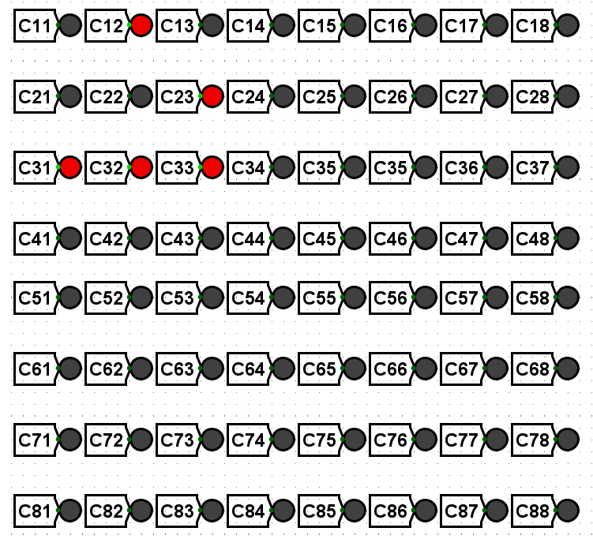

# Game of Life in Logisim

This project implements the widely-known cellular automaton made by John Conway using registers in the Logisim simulation software.

## Cells

Each cell is represented with a circuit with 8 inputs and 1 output. The inputs represent the state of the neighbours of the current cell. The neighbours are: `NW` (northwest), `N` (north), `NE` (northeast), `W` (west), `E` (east), `SW` (southwest), `S` (south) and `SE` (southeast).

For sets to be initialised as either "dead" or "alive", an additional `SET` input is used, which, with the help of a register, is reset to 0 after the first clock tick, in order to prevent "zombie" cells (cells which are always alive).

## Rules

1. Living cells die of loneliness if they don't have enough neighbours. (< 2)
2. Living cells die of starvation if they have too many neighbours. (> 3)
3. Living cells die of loneliness if they don't have enough neighbours. (< 2)

The rules are implemented using comparators. After the state is determined, it is stored using a second register.

## Limitations and features

* The game is implemented with a **toroidal grid**, that is, instead of the cells dying upon reaching the edge, they are placed back at the beginning
* The screen is made up of 8x8 LEDs, each of which depend upon a `game_of_life_cell` circuit
* Extending the screen is not trivial, as it requires a grid of circuits equal in size to the screen